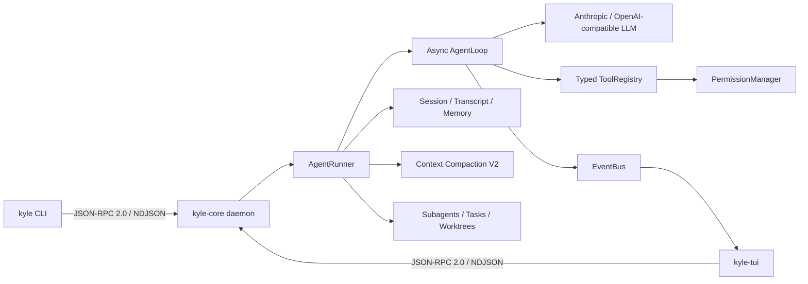

# KyleClaude

KyleClaude 是一个使用 Python 3.12 构建的本地 AI 编程 Agent 运行时。它采用 `kyle-core` 常驻守护进程与 CLI/TUI 客户端分离的双进程架构，在一条可观测、可恢复、受权限约束的执行链路中完成模型调用、工具执行、会话持久化、上下文压缩和多 Agent 协作。

它不是一次性调用大模型的聊天 Demo。项目重点是 Coding Agent 背后的工程系统：类型化协议、异步运行时、工具安全、上下文治理、任务隔离和故障恢复。


## 核心架构



Core daemon 负责持有 Agent、会话、后台任务和权限状态；CLI 与 TUI 只是客户端。前端退出不会改变协议边界，后续也可以在相同 IPC 之上增加 Web 或 IDE 客户端。

## 主要能力

| 领域 | 当前实现 |
|---|---|
| Agent Loop | 异步 Plan-Act-Observe 循环、流式 token、工具结果回填、限流退避与上下文溢出恢复 |
| 类型化协议 | Pydantic v2 命令/事件模型、JSON-RPC 2.0、NDJSON 流、自动生成协议文档 |
| 本地安全 | loopback 限制、首帧 token 认证、工作区边界、参数校验、交互审批与 headless 权限模式 |
| 代码工具 | Read、Glob、Grep、Edit、Write、Apply Patch、Git Diff、Bash、Checkpoint/Rewind |
| 会话系统 | 多轮 thread、block 级 transcript、崩溃尾部恢复、会话恢复/分叉/导出/删除 |
| 长期记忆 | 项目级 JSON 记录、Markdown 索引、来源追踪、敏感信息脱敏和中英文词法召回 |
| 上下文治理 | 80% 自动压缩、最近窗口保留、结构化摘要、质量门禁、工具输出分级和增量压缩 |
| 多 Agent | 子 Agent、任务创建/认领、后台任务、Git worktree 隔离和独立工作区边界 |
| 扩展机制 | Skills、MCP 工具接入、UserPromptSubmit/PreToolUse/PostToolUse/Stop 异步 Hooks |
| 可观测性 | TUI 实时事件、token 水位、工具与审批状态、压缩指标、events.jsonl 和脱敏 Trace |

## 快速开始

### 环境要求

- Python `3.12`
- [uv](https://docs.astral.sh/uv/)
- Git

### 1. 安装依赖

```powershell
git clone https://github.com/kyletser/kyleclaude.git
cd kyleclaude
uv sync
Copy-Item .env.example .env
```

macOS/Linux 可使用：

```bash
cp .env.example .env
```

### 2. 配置模型

Anthropic：

```dotenv
KYLE_LLM_PROVIDER=anthropic
ANTHROPIC_API_KEY=sk-ant-your-key
KYLE_LLM_DEFAULT_MODEL=claude-sonnet-4-6
```

OpenAI-compatible 接口：

```dotenv
KYLE_LLM_PROVIDER=openai_compatible
KYLE_LLM_BASE_URL=https://example.com/v1/chat/completions
KYLE_LLM_API_KEY_ENV=KYLE_LLM_API_KEY
KYLE_LLM_API_KEY=your-api-key
KYLE_LLM_DEFAULT_MODEL=your-model
```

`KYLE_LLM_BASE_URL` 应填写完整的 Chat Completions 地址。密钥只放在本地 `.env` 或系统环境变量中，不要提交到 Git。

OpenCode Zen 示例：

```dotenv
KYLE_LLM_PROVIDER=openai_compatible
KYLE_LLM_BASE_URL=https://opencode.ai/zen/go/v1/chat/completions
KYLE_LLM_API_KEY_ENV=KYLE_LLM_API_KEY
KYLE_LLM_API_KEY=replace-with-your-key
KYLE_LLM_DEFAULT_MODEL=deepseek-v4-pro
```

### 3. 启动 Core 与 TUI

终端 1：

```powershell
uv run kyle-core
```

终端 2：

```powershell
uv run kyle-tui
```

Core 首次启动会生成 `~/.kyle/ipc-token`。CLI/TUI 会自动读取该文件，并在发送业务命令前完成本机认证。

也可以将 Core 放到后台管理：

```powershell
uv run kyle core start
uv run kyle core status
uv run kyle core stop
```

## 使用方式

### TUI

TUI 是项目的主要交互界面，支持流式响应、工具调用折叠块、权限审批、上下文水位和后台任务事件。

| 命令 | 作用 |
|---|---|
| `/new` | 创建并切换到新会话 |
| `/sessions` | 打开历史会话选择器 |
| `/compact` | 手动执行结构化上下文压缩 |
| `/skill_name` | 调用已安装 Skill |
| `Ctrl+Q` | 退出 TUI |

### CLI

CLI 适合脚本、调试和无人值守任务：

```powershell
uv run kyle ping
uv run kyle chat
uv run kyle run --goal "分析项目并运行测试"
uv run kyle sessions --all
uv run kyle trace --follow
```

Headless 任务默认采用 `fail-fast`：遇到需要人工审批的工具立即退出。明确允许自动执行的工具时使用 allow-list：

```powershell
uv run kyle run --goal "修改并验证代码" `
  --permission-mode allow-list `
  --allow-tool edit_file `
  --allow-tool apply_patch `
  --allow-tool bash
```

allow-list 仍不能绕过危险命令规则和工作区边界。

### 会话管理

```powershell
uv run kyle sessions --all
uv run kyle chat --resume SESSION_ID
uv run kyle session rename SESSION_ID "新标题"
uv run kyle session fork SESSION_ID --title "实验分支"
uv run kyle session export SESSION_ID --format markdown -o session.md
uv run kyle session delete SESSION_ID --yes
```

## 上下文压缩 V2

KyleClaude 不会在窗口耗尽时简单删除最早消息。默认策略是：

1. 小型工具输出保留原文，中型输出保留头尾，超大输出优先由 LLM 蒸馏。
2. 将 `tool_use` 与 `tool_result` 视为不可拆分的协议闭环。
3. 保留约 25% 最近消息原文，只压缩较旧历史。
4. 要求模型生成目标、完成项、约束、决策、文件、TODO、错误和关键数据的 JSON 摘要。
5. 使用 Pydantic 校验结构，并检查约束、TODO、错误和文件路径是否丢失。
6. 后续压缩增量合并上一版摘要，不重复处理完整 transcript。
7. TUI 展示触发原因、压缩前后 token、保留消息数、质量分和摘要文件路径。

```toml
[compaction]
auto_threshold = 0.80
retain_ratio = 0.25
tool_result_limit = 8000
tool_result_keep = 4000
tool_result_summarize_threshold = 20000
```

## 记忆与任务隔离

长期记忆写入 `.kyle/memory/`，支持 `memory_save`、`memory_search` 和 `memory_forget`。当前检索使用确定性的中英文词法打分，没有引入向量数据库或外部 embedding 服务。

复杂任务可以通过任务系统和子 Agent 拆分。`task_claim` 提供原子认领；worktree 工具将并行修改限制在 `.kyle/worktrees/`；子 Agent 的文件、Bash、Git 和 Checkpoint 工具都会绑定到指定 worktree。

后台命令由 daemon 级注册表持有，因此可以跨对话轮次查询和取消；daemon 退出时会清理关联进程树。

## 项目结构

```text
src/kyle_claude/
├── cli/                 # CLI 命令与 IPC 客户端
├── tui/                 # Textual 终端界面
└── core/
    ├── bus/             # 类型化命令、事件与 JSON-RPC envelope
    ├── transport/       # TCP NDJSON server/client 与认证
    ├── compact/         # 上下文预算、结构化摘要和协议校验
    ├── tools/           # 工具注册、调用、权限与内置工具
    ├── session/         # 会话、transcript、导出和恢复
    ├── memory/          # 项目长期记忆
    ├── background/      # daemon 级后台任务
    ├── task/            # 多 Agent 任务状态
    ├── worktree/        # Git worktree 生命周期
    ├── subagent/        # 子 Agent 调度
    ├── hooks/           # 异步生命周期扩展点
    ├── skills/          # Skill 加载
    └── mcp/             # MCP server 管理
```

## 开发与验证

```powershell
uv run ruff check .
uv run mypy src
uv run pytest -q
uv run python scripts\gen_protocol_doc.py --check
```

完整发布前门禁：

```powershell
make verify
```

当前测试基线为 `407 passed, 3 skipped`。测试覆盖协议、传输、Agent Loop、工具权限、上下文压缩、会话恢复、记忆、后台任务和 worktree 管理。

## 设计文档

- [技术架构](TECH_ARCHITECTURE.md)
- [Wire Protocol](WIRE_PROTOCOL.md)
- [运行手册](RUNBOOK.md)
- [轻量 Agent 完成度审计](docs/LIGHTWEIGHT_AGENT_COMPLETION_AUDIT.md)
- [与 Claude Code 的差距分析](docs/KYLECLAUDE_VS_CLAUDE_CODE_GAP_ANALYSIS.md)
- [learn-claude-code 机制移植说明](docs/LEARN_CLAUDE_CODE_PORT.md)

## 项目定位

KyleClaude 适合作为 AI Agent 工程方向的学习与求职项目，因为它能够完整讨论以下问题：

- 为什么采用 daemon + client，而不是单进程脚本？
- 如何保证工具调用的类型安全、权限安全和文件事务安全？
- 如何让长会话在压缩、崩溃和取消后继续运行？
- 如何隔离并行子 Agent 的代码修改？
- 如何用事件、Trace 和测试证明 Agent 不是黑盒？

项目仍是面向学习和本地开发的 mini Coding Agent，不宣称一比一复刻 Claude Code 或 Codex。

## License

[MIT](LICENSE)
